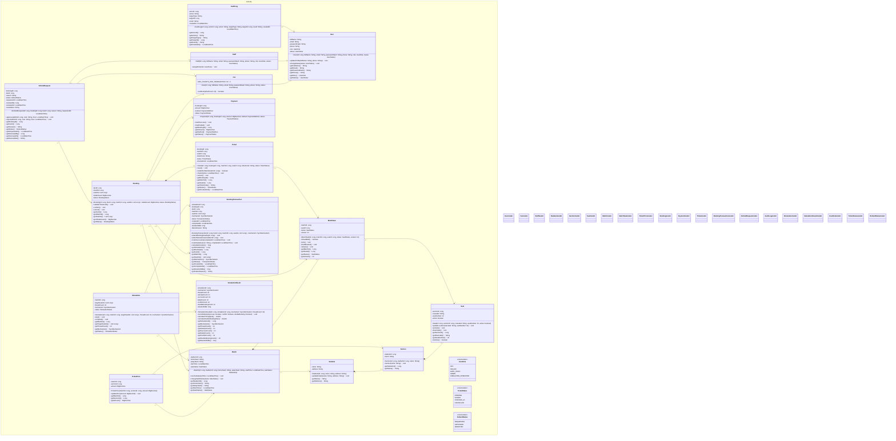

# 06 Model Relationships

```mermaid
classDiagram
    direction TB

    namespace MODEL {
        class User {
            -fullName: String
            -email: String
            -passwordHash: String
            -phone: String
            -role: UserRole
            -status: UserStatus
            +User(id: Long, fullName: String, email: String, passwordHash: String, phone: String, role: UserRole, status: UserStatus)
            +updateProfile(fullName: String, phone: String): void
            +changeStatus(status: UserStatus): void
            +getFullName(): String
            +getEmail(): String
            +getPasswordHash(): String
            +getPhone(): String
            +getRole(): UserRole
            +getStatus(): UserStatus
        }

        class Fan {
            -MAX_TICKETS_PER_TRANSACTION: int = 4
            +Fan(id: Long, fullName: String, email: String, passwordHash: String, phone: String, status: UserStatus)
            +canBook(ticketCount: int): boolean
        }

        class Staff {
            +Staff(id: Long, fullName: String, email: String, passwordHash: String, phone: String, role: UserRole, status: UserStatus)
            +assignRole(role: UserRole): void
        }

        class Stadium {
            -name: String
            -address: String
            +Stadium(id: Long, name: String, address: String)
            +updateDetails(name: String, address: String): void
            +getName(): String
            +getAddress(): String
        }

        class Section {
            -stadiumId: Long
            -name: String
            +Section(id: Long, stadiumId: Long, name: String)
            +rename(name: String): void
            +getStadiumId(): Long
            +getName(): String
        }

        class Seat {
            -sectionId: Long
            -rowLabel: String
            -seatNumber: int
            -active: boolean
            +Seat(id: Long, sectionId: Long, rowLabel: String, seatNumber: int, active: boolean)
            +updateLocation(rowLabel: String, seatNumber: int): void
            +activate(): void
            +deactivate(): void
            +getSectionId(): Long
            +getRowLabel(): String
            +getSeatNumber(): int
            +isActive(): boolean
        }

        class Match {
            -stadiumId: Long
            -homeTeam: String
            -awayTeam: String
            -startTime: LocalDateTime
            -saleStatus: SaleStatus
            +Match(id: Long, stadiumId: Long, homeTeam: String, awayTeam: String, startTime: LocalDateTime, saleStatus: SaleStatus)
            +reschedule(startTime: LocalDateTime): void
            +changeSaleStatus(status: SaleStatus): void
            +getStadiumId(): Long
            +getHomeTeam(): String
            +getAwayTeam(): String
            +getStartTime(): LocalDateTime
            +getSaleStatus(): SaleStatus
        }

        class MatchSeat {
            -matchId: Long
            -seatId: Long
            -status: SeatStatus
            -version: int
            +MatchSeat(id: Long, matchId: Long, seatId: Long, status: SeatStatus, version: int)
            +isAvailable(): boolean
            +lock(): void
            +markBooked(): void
            +release(): void
            +getMatchId(): Long
            +getSeatId(): Long
            +getStatus(): SeatStatus
            +getVersion(): int
        }

        class TicketPrice {
            -matchId: Long
            -sectionId: Long
            -amount: BigDecimal
            +TicketPrice(matchId: Long, sectionId: Long, amount: BigDecimal)
            +updatePrice(amount: BigDecimal): void
            +getMatchId(): Long
            +getSectionId(): Long
            +getAmount(): BigDecimal
        }

        class Booking {
            -fanId: Long
            -matchId: Long
            -seatIds: List~Long~
            -totalAmount: BigDecimal
            -status: BookingStatus
            +Booking(id: Long, fanId: Long, matchId: Long, seatIds: List~Long~, totalAmount: BigDecimal, status: BookingStatus)
            +validateTicketLimit(): void
            +confirm(): void
            +cancel(): void
            +getFanId(): Long
            +getMatchId(): Long
            +getSeatIds(): List~Long~
            +getTotalAmount(): BigDecimal
            +getStatus(): BookingStatus
        }

        class Payment {
            -bookingId: Long
            -amount: BigDecimal
            -method: PaymentMethod
            -status: PaymentStatus
            +Payment(id: Long, bookingId: Long, amount: BigDecimal, method: PaymentMethod, status: PaymentStatus)
            +markSuccess(): void
            +markFailed(): void
            +getBookingId(): Long
            +getAmount(): BigDecimal
            +getMethod(): PaymentMethod
            +getStatus(): PaymentStatus
        }

        class Ticket {
            -bookingId: Long
            -matchId: Long
            -seatId: Long
            -ticketCode: String
            -status: TicketStatus
            -checkedInAt: LocalDateTime
            +Ticket(id: Long, bookingId: Long, matchId: Long, seatId: Long, ticketCode: String, status: TicketStatus)
            +issue(): void
            +isValidForMatch(matchId: Long): boolean
            +checkIn(time: LocalDateTime): void
            +cancel(): void
            +getBookingId(): Long
            +getMatchId(): Long
            +getSeatId(): Long
            +getTicketCode(): String
            +getStatus(): TicketStatus
            +getCheckedInAt(): LocalDateTime
        }

        class BookingTransaction {
            -simulationId: Long
            -bookingId: Long
            -fanId: Long
            -matchId: Long
            -seatIds: List~Long~
            -mechanism: SyncMechanism
            -status: TransactionStatus
            -createdAt: LocalDateTime
            -completedAt: LocalDateTime
            -durationMillis: long
            -failureReason: String
            +BookingTransaction(id: Long, fanId: Long, matchId: Long, seatIds: List~Long~, mechanism: SyncMechanism)
            +attachBooking(bookingId: Long): void
            +attachSimulation(simulationId: Long): void
            +markSuccessful(completedAt: LocalDateTime): void
            +markFailed(reason: String, completedAt: LocalDateTime): void
            +calculateDuration(): long
            +getSimulationId(): Long
            +getBookingId(): Long
            +getFanId(): Long
            +getMatchId(): Long
            +getSeatIds(): List~Long~
            +getMechanism(): SyncMechanism
            +getStatus(): TransactionStatus
            +getCreatedAt(): LocalDateTime
            +getCompletedAt(): LocalDateTime
            +getDurationMillis(): long
            +getFailureReason(): String
        }

        class RefundRequest {
            -bookingId: Long
            -fanId: Long
            -reason: String
            -status: RefundStatus
            -requestedAt: LocalDateTime
            -reviewedBy: Long
            -reviewedAt: LocalDateTime
            -reviewNote: String
            +RefundRequest(id: Long, bookingId: Long, fanId: Long, reason: String, requestedAt: LocalDateTime)
            +approve(adminId: Long, note: String, time: LocalDateTime): void
            +reject(adminId: Long, note: String, time: LocalDateTime): void
            +getBookingId(): Long
            +getFanId(): Long
            +getReason(): String
            +getStatus(): RefundStatus
            +getRequestedAt(): LocalDateTime
            +getReviewedBy(): Long
            +getReviewedAt(): LocalDateTime
            +getReviewNote(): String
        }

        class AuditLog {
            -actorId: Long
            -action: String
            -targetType: String
            -targetId: Long
            -result: String
            -createdAt: LocalDateTime
            +AuditLog(id: Long, actorId: Long, action: String, targetType: String, targetId: Long, result: String, createdAt: LocalDateTime)
            +getActorId(): Long
            +getAction(): String
            +getTargetType(): String
            +getTargetId(): Long
            +getResult(): String
            +getCreatedAt(): LocalDateTime
        }

        class Simulation {
            -matchId: Long
            -targetSeatIds: List~Long~
            -threadCount: int
            -mechanism: SyncMechanism
            -status: SimulationStatus
            +Simulation(id: Long, matchId: Long, targetSeatIds: List~Long~, threadCount: int, mechanism: SyncMechanism)
            +start(): void
            +complete(): void
            +getMatchId(): Long
            +getTargetSeatIds(): List~Long~
            +getThreadCount(): int
            +getMechanism(): SyncMechanism
            +getStatus(): SimulationStatus
        }

        class SimulationResult {
            -simulationId: Long
            -mechanism: SyncMechanism
            -threadCount: int
            -attemptCount: int
            -successCount: int
            -failedCount: int
            -conflictCount: int
            -doubleBookingCount: int
            -durationMillis: long
            +SimulationResult(id: Long, simulationId: Long, mechanism: SyncMechanism, threadCount: int)
            +recordAttempt(success: boolean, conflict: boolean, doubleBooking: boolean): void
            +calculateThroughput(): double
            +calculateDoubleBookingRate(): double
            +getSimulationId(): Long
            +getMechanism(): SyncMechanism
            +getThreadCount(): int
            +getAttemptCount(): int
            +getSuccessCount(): int
            +getFailedCount(): int
            +getConflictCount(): int
            +getDoubleBookingCount(): int
            +getDurationMillis(): long
        }

        class UserRole {
            <<enumeration>>
            FAN
            SELLER
            GATE_STAFF
            ADMIN
            SIMULATOR_OPERATOR
        }

        class TicketStatus {
            <<enumeration>>
            PENDING
            ISSUED
            CHECKED_IN
            CANCELLED
        }

        class RefundStatus {
            <<enumeration>>
            REQUESTED
            APPROVED
            REJECTED
        }

    }

    Fan --|> User
    Staff --|> User
    Stadium "1" *-- "0..*" Section
    Section "1" *-- "0..*" Seat
    Match "0..*" --> "1" Stadium
    Match "1" *-- "0..*" MatchSeat
    MatchSeat "0..*" --> "1" Seat
    TicketPrice "0..*" --> "1" Match
    TicketPrice "0..*" --> "1" Section
    Booking "0..*" --> "1" Fan
    Booking "0..*" --> "1" Match
    Booking "0..1" --> "1..4" MatchSeat
    Booking "1" --> "0..1" Payment
    Booking "1" *-- "0..4" Ticket
    Booking "0..1" --> "1..*" BookingTransaction
    RefundRequest "0..*" --> "1" Booking
    RefundRequest "0..*" --> "1" Fan
    RefundRequest "0..*" --> "0..1" Staff
    Ticket "0..1" --> "1" MatchSeat
    AuditLog "0..*" --> "1" User
    Simulation "0..*" --> "1" Match
    Simulation "1" --> "0..*" SimulationResult
    Simulation "1" --> "0..*" BookingTransaction

    classDef view fill:#eef6ff,stroke:#3b82f6,color:#102a43,stroke-width:1px
    classDef controller fill:#edfcf3,stroke:#22a06b,color:#102a43,stroke-width:1px
    classDef repository fill:#fff7e8,stroke:#d97706,color:#102a43,stroke-width:1px
    classDef model fill:#f7f0ff,stroke:#845ec2,color:#102a43,stroke-width:1px
    classDef helper fill:#f1f5f9,stroke:#64748b,color:#102a43,stroke-width:1px
    class User model
    class Fan model
    class Staff model
    class Stadium model
    class Section model
    class Seat model
    class Match model
    class MatchSeat model
    class TicketPrice model

    class Booking model
    class Payment model
    class Ticket model
    class BookingTransaction model
    class RefundRequest model
    class AuditLog model
    class Simulation model
    class SimulationResult model
    class UserRole model
    class TicketStatus model
    class RefundStatus model
```
